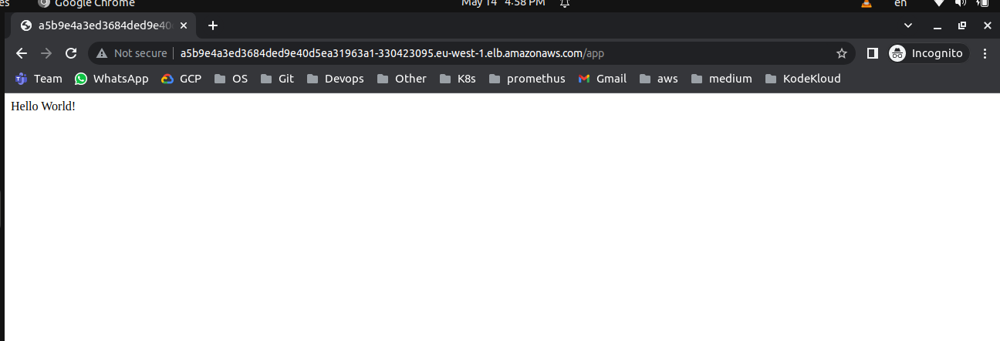
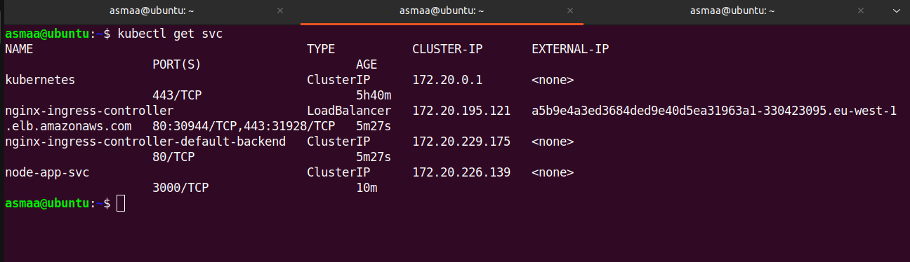
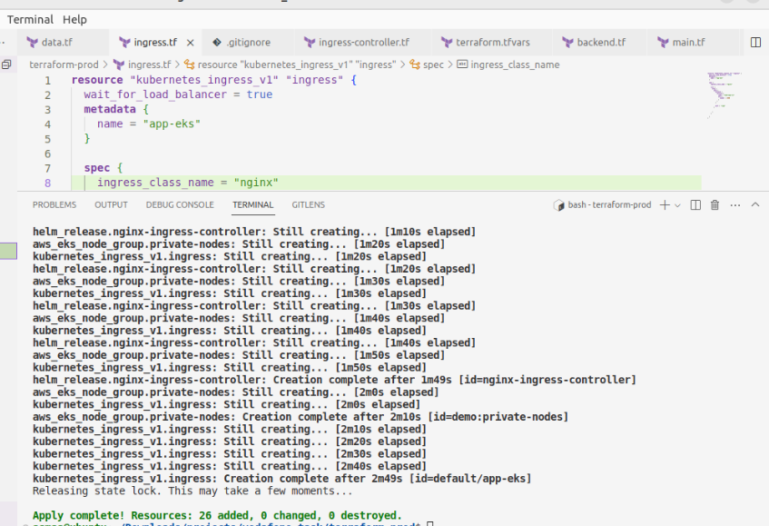

# task_1

1- create eks cluster with node [t2.medium] in private subnet using terraform 
2- create simple node app and dockerfile
3- create deployment ans svc for app
4- analysis code with sonarqube
5- uses nginx-controller and nginx rule to deploy in eks using terraform 
6- use github actions workflow for ci/cd pipeline

